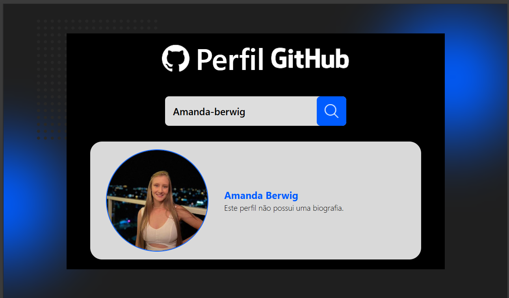
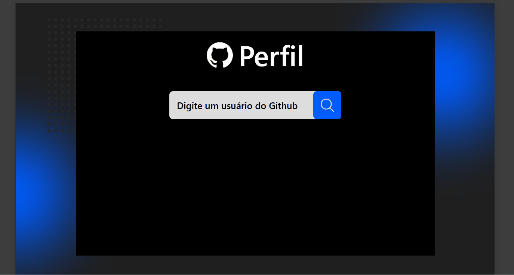

# Projeto - Processo Seletivo Avanti 🚀

Este projeto foi desenvolvido como parte do **processo seletivo do programa de estágio Innovation Class Tech - Desenvolvimento Front-End**.

🔗 [Acesse o teste técnico](https://ic.penseavanti.com.br/mod/page/view.php?id=51)

🔗[Veja o projeto online(GitHub Pages)](https://amanda-berwig.github.io/busca-github/)

## 📝 Requisitos para o desenvolvimento

1️⃣ Estruturação
Desenvolver a aplicação conforme layout do Figma
🔗 [Layout](https://www.figma.com/proto/DqtFxC6312M32mLt8FpJjq/innovation-class?page-id=22%3A2864&node-id=22-4293&viewport=359%2C115%2C0.25&t=SHsEqEgaMrXGMKwv-1&scaling=scale-down-width&content-scaling=fixed&starting-point-node-id=22%3A4293&show-proto-sidebar=1)

2️⃣ Criar um campo de busca, onde o usuário digita o nome de um perfil do GitHub

3️⃣ Ao clicar no botão de busca, a aplicação deve consumir a API do GitHub e exibir as seguintes informações do usuário, customizando conforme layout do figma:

- Nome do usuário
- Foto de perfil
- Bio

4️⃣ Exibir mensagens de erro caso o perfil não seja encontrado

Opcional: Melhorar a experiência do usuário com efeitos visuais e loading durante a requisição.

## 🛠️ Tecnologias Utilizadas

- React
- Tailwind CSS
- API pública do GitHub (consumo via `fetch`) -[API](https://docs.github.com/pt/rest)

---

## 📸 Prints do Projeto

### 💻 Versão Desktop



### 🔎 Funcionalidade de Busca Dinâmica



---

## ▶️ Como executar o projeto

1. Clone o repositório:

```bash
git clone https://github.com/Amanda-Berwig/Avanti--innovation-class.git
```

2. Acesse a pasta do projeto:

```bash
cd Avanti--innovation-class
```

3. Instale as dependências:

```bash
npm install
```

4. Execute o projeto:

```bash
npm run dev
```

5. Abra no navegador: http://localhost:5173
